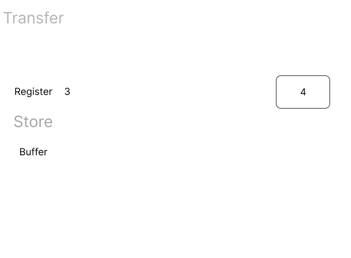
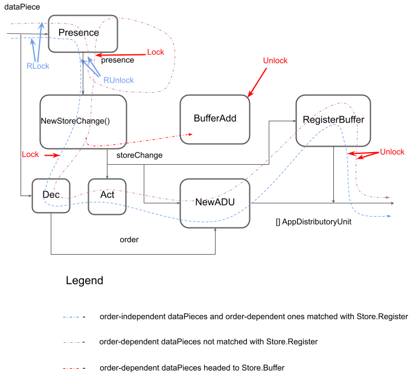

## Synchronization
#### Store

All dataPieces are handled concurrently by 4 workers. Then they are reassembled and sent via gRPC. Its important to keep initial order when sending dataPiece groups which represent file data chunks. Otherwise files will be corrupted. For that reason store is used. Store action is briefly shown here:

Store is represented by three maps: Register, Buffer and Counter. 

**Register**

Stores current state of store. If dataPiece's part is matched to Register's, dataPiece is headed to transfer and Register's part is increased by 1, otherwise it stores in Buffer. After successful registration, Buffer elements are trying to register.

**Buffer**

Stores dataPieces. Keeps  being sorted after each dataPiece addition. Tries to register stored elements after successful registration of new dataPiece

**Counter**

Stores counters for dataPiece groups and flags for marking dataPiece as first, last, etc.

#### Application

Application handles dataPieces using store methods Presence(), Dec(), Act(), RegisterBuffer(), BufferAdd(). All of them are executed by workers in concurrent way and needed to be synchronized:

sync.RWMutex is used for synchronization

## HTTPS
Server listens port 443 for https connections. It uses generated private key and selfsigned certificate. Certificate can be authorized for production purposes.
Key and certificate are in "tls" folder.
