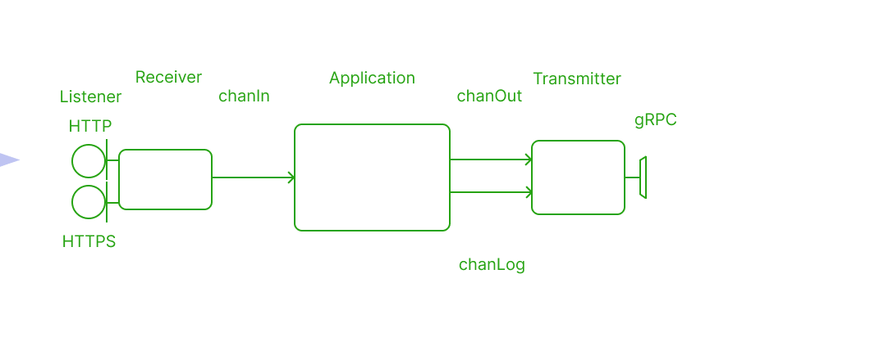

## Installation

Requirements: Docker and docker compose installed
- download [docker-compose.yaml](https://github.com/vynovikov/postParser/blob/main/docker-compose.yaml)
-  run ``docker-compose up`` in folder with docker-compose.yaml file

#### What is postParser?
HTTP request exchange is the most common type of internet communication. Each service participating in the communication performs task of processing HTTP requests. PostParser is highly efficient example of such processor.

#### What does postParser do actually?
PostParser parses incoming HTTP (and HTTPS) request in concurrent way, converts it into convenient form and sends output via gRPC. Second service ([postSaver](https://github.com/vynovikov/postSaver)) gets output and saves it to disk as files. Third service ([postLogger](https://github.com/vynovikov/postLogger)) gets logs from postParser and saves them to disk similarly. 

POST request should use **multipart/form-data** content type. Each form may contain text field or file. 

#### Demonstration

https://user-images.githubusercontent.com/19687368/232817578-f8e998d7-d582-4b48-91f0-c83aaefffb5a.mp4

## Architecture

PostParser has hexagonal architecture. All its modules are loosely coupled and can be modified easily without affecting each other. 

*DataPiece* is the major object in the context of work. It's a pointer to struct containing byte slice and header. PostParser extracts dataPieces from http (or https) request, handles and sends them via gRPC. 

**Receivers** are listening ports 3000 and 443, catching incoming HTTP and HTTPS requests, converting them and put into chanIn channel. Private key and selfsigned certificate are used for HTTPS. Certificate can be authorized for production purposes.

**Transmitter** gets data and logs from chanOut and chanLog. Transmits data and logs to [postSaver](https://github.com/vynovikov/postSaver) and [postLogger](https://github.com/vynovikov/postLogger) respectively.

**Store** provides statefulness of postParser. Store is represented by three maps: Register, Buffer and Counter. 

> **Register**
>Stores current state of store. If dataPiece's part is matched with Register's, dataPiece is headed to transfer and Register's part is increased by 1, otherwise it stores in Buffer. After successful registration, Buffer elements are trying to register.

>**Buffer**
>Stores dataPieces. Keeps  being sorted after each addition. Tries to register stored elements after successful registration of new dataPiece

​																													*\* click image below to activate the animation*

>**Counter**
>Stores counters for dataPiece groups and flags for marking output as first, last, etc.

**Application** is designed as pool of workers. Workers are ranging over chanIn. When receiving data, worker converts it into form necessary for the transmitter and put result into chanOut and logs into chanLog. Application provides worker synchronization and data ordering also.

Application uses several methods for dataPiece handling. Some of these methods are interacting with store maps. They are executed by workers in concurrent way. Execution needs to be synchronized to avoid data race:

sync.RWMutex is used for synchronization

## Graceful shutdown

After receiving interrupt signal, application first finishes its current work , then terminates.

​											*\* click image below to activate the animation*

​										*\*\* timescale used is for illustrative purposes only and does not reflect the actual duration of the process*

#### Action sequence

* HTTP and HTTP listeners are closed immediately.  Application cannot receive new requests from that moment on
* Wait for receiver goroutines to finish their job, then close chanIn (channel used to deliver new data for application). If there are no jobs, chanIn is closed immediately
* Wait for application workers to stop, then close chanOut (channel used to deliver data to transmitting module)
* Waiting for transmitter goroutines to stop then close whole app

sync.RWMutex and sync.WaitGroup are used to perform these actions.
