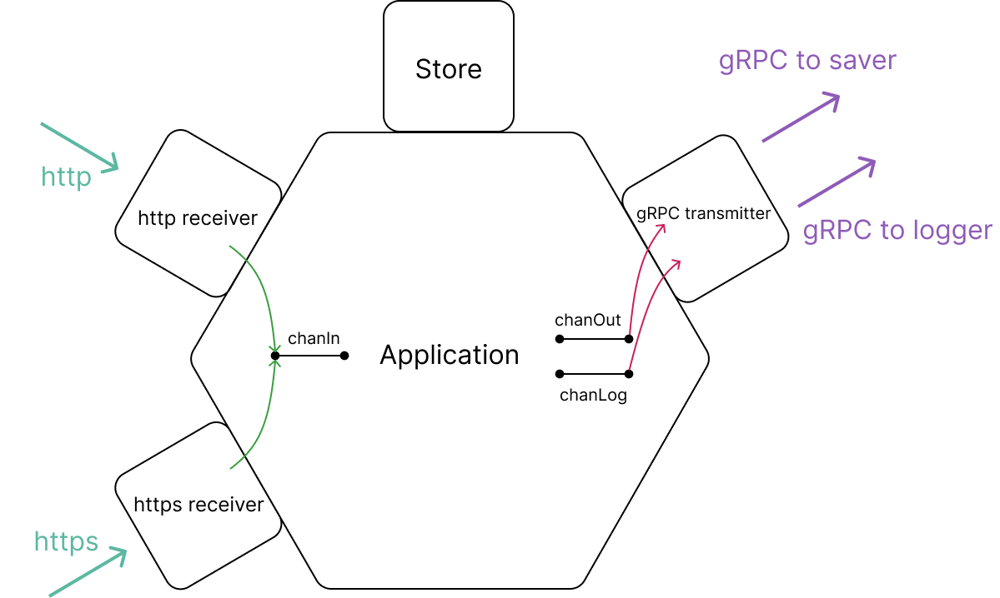
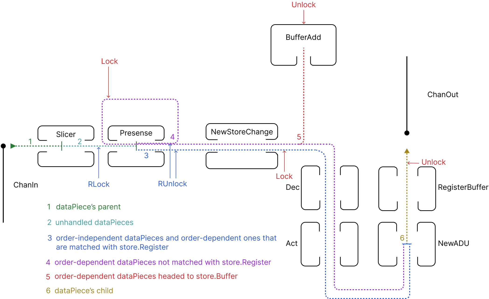
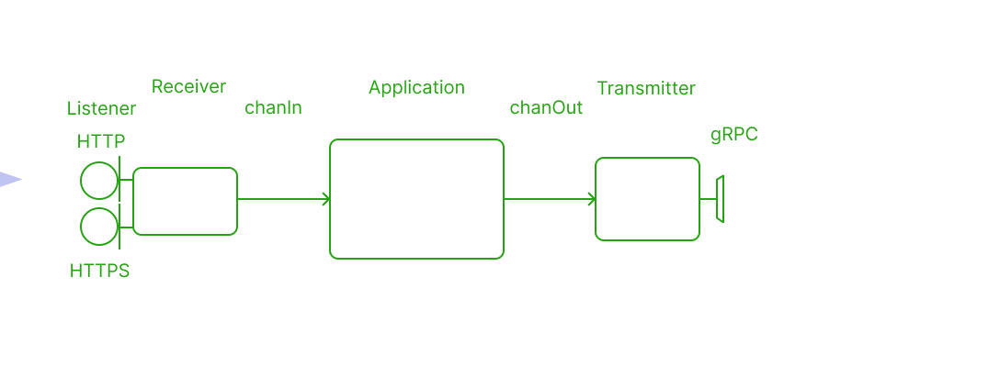

## Installation

Requirements: Docker and docker compose installed
- download [docker-compose.yaml](https://github.com/vynovikov/postParser/blob/main/docker-compose.yaml)
-  run ``docker-compose up``

#### What does postParser do?
PostParser parses incoming http(https) request, converts it into convenient form and sends output via gRPC. Second service ([postSaver](https://github.com/vynovikov/postSaver)) gets output and stores it on disk as files. Third service ([postLogger](https://github.com/vynovikov/postLogger)) gets logs from postParser and saves the on disk similarly. 

POST request should use **multipart/for-data** content type. Each form may contain text field or file. 

## Architecture

PostParser has hexagonal architecture. All its modules are loosely coupled and can be modified easily with no affect on other ones. 

**Receivers** are listening ports 3000 and 443, catching incoming http and https requests, converting them and put into chanIn channel.

**Application** is pool of workers which is ranging over chanIn. After receiving data from chanIn, worker converts it into form necessary for the transmitter and put result into chanOut and logs into chanLog. Application provides worker synchronization and data ordering also.

**Transmitter** gets data and logs from chanOut and chanLog. Transmits data and logs to [postSaver](https://github.com/vynovikov/postSaver) and [postLogger](https://github.com/vynovikov/postLogger) respectively.

## DataPiece

DataPiece is the major object in the context of work. It's a pointer to struct containing byte slice and header. PostParser extracts dataPieces from http (or https) request, handles and sends them via gRPC. 

## Synchronization and ordering

#### Application

Application uses several methods for dataPiece handling: Presence(), Dec(), Act(), RegisterBuffer(), BufferAdd(). Some of these methods are interacting with store maps. They are executed by workers in concurrent way. Execution needs to be synchronized to avoid data race:

sync.RWMutex is used for synchronization

#### Store

DataPieces are reassembled before sending via gRPC. It is important to keep initial order when sending dataPiece group which represent file data chunks. Otherwise file would be corrupted. For that reason store is used:

Store is represented by three maps: Register, Buffer and Counter. 

**Register**

Stores current state of store. If dataPiece's part is matched with Register's, dataPiece is headed to transfer and Register's part is increased by 1, otherwise it stores in Buffer. After successful registration, Buffer elements are trying to register.

**Buffer**

Stores dataPieces. Keeps  being sorted after each addition. Tries to register stored elements after successful registration of new dataPiece

**Counter**

Stores counters for dataPiece groups and flags for marking output as first, last, etc.

## HTTPS
Server listens port 443 for https connections. It uses generated private key and selfsigned certificate. Certificate can be authorized for production purposes.
Key and certificate are in "tls" folder.

## Graceful shutdown

After receiving interrupt signal, application first finishes its current work , then terminates.

​																													\* process durations are shown schematically

#### Action sequence

* HTTP and HTTP listeners are closed immediately.  Application cannot receive new requests from that moment on
* Waiting for receiver goroutines to finish their job, then close chanIn (channel used to deliver new data for application). If there are no jobs, chanIn are closed immediately
* Waiting for application workers to stop, then close chanOut (channel used to deliver data to transmitting module)
* Waiting for transmitter goroutines to stop then close whole app

sync.RWMutex and sync.WaitGroup are used to perform these actions.